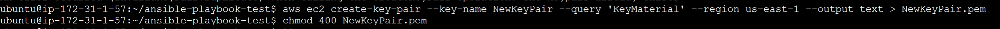
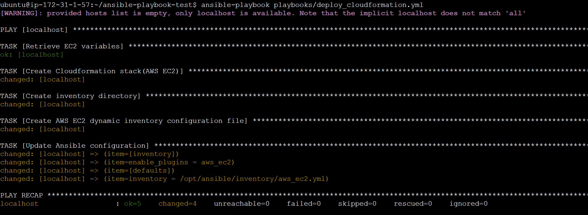
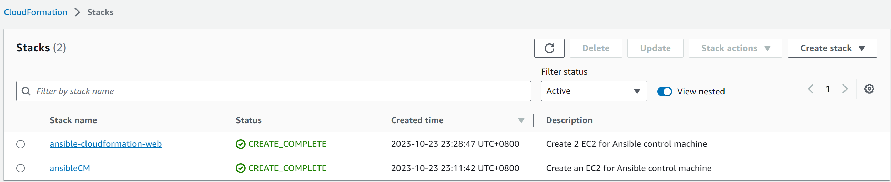
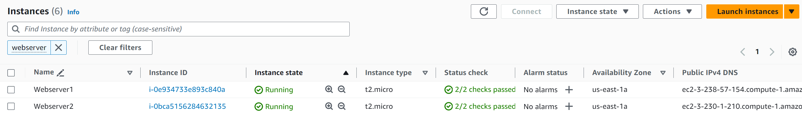
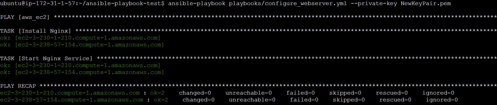
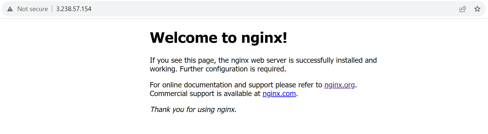

# Ansible and AWS CloudFormation: Configuring AWS EC2 Resources
Deploying and configuring AWS EC2 using Ansible and Cloudformation.


## Introduction
Ansible is an open-source automation tool designed for configuration management, application deployment, and task automation. It simplifies IT operations by allowing users to define and automate workflows using YAML-based playbooks, making it easier to manage and orchestrate infrastructure and applications across multiple servers or devices.
<br/>
In this simple Ansible project, I've automated the deployment of AWS EC2 instances running Nginx. This playbook first sets up the AWS CloudFormation stack and then configures dynamic inventory, allowing the management of the EC2 instances. The final step involves installing Nginx on the EC2 instances using a playbook.


## Configuration Files

1. **Cloudformation template for Ansible EC2(ansible_cm_ec2.yml)**:
<br/>Ansible can be installed locally on a computer, but for this project, I've opted to install Ansible on an EC2 instance. The Ansible EC2 instance has been assigned a IAM Role with power user access so that it can access and manage the servers.

2. **Ansible Playbooks**:
* deploy_cloudformation.yml: This playbook deploys two EC2 instances with SSH and HTTP access using the CloudFormation template, cloudformation_web_ec2.yml.
* configure_webserver.yml: This playbook installs and starts the Nginx service on the two EC2 instances.


## Prerequisites
Before getting started, ensure that the following prerequisites are in place:
1. AWS CLI configured with your AWS account credentials.
2. A text editor (e.g. Visual Studio Code).

## Getting Started

### Deploying Ansible Instance(Optional)
Ansible can be installed locally on a computer or on a dedicated EC2 instance. For this project i have deploy an EC2 instance to run the Ansible.
<br/>
<br/>Run the below command in the Command Prompt
```
aws cloudformation create-stack --stack-name YOURSTACKNAME --template-body file://C:/YOUR/FILE/PATH/TO/ansible_cm_ec2.yml  --capabilities CAPABILITY_NAMED_IAM
```
After running the command, the cloudformation stack and instance will be created.


### Cloning from the repository

Change the current working directory to the location where you want the cloned directory to be.
```
cd '/TO/YOUR/FILE PATH'
git clone https://LINKFROMGITHUB
```

### Creating a Keypair for two Web EC2 instances

```
aws ec2 create-key-pair --key-name NewKeyPair --query 'KeyMaterial' --region us-east-1 --output text > NewKeyPair.pem
chmod 400 NewKeyPair.pem
```



### Deploying the first playbook

Sets up the AWS CloudFormation stack to deploy the 2 Web Server and configures dynamic inventory
```
ansible-playbook playbooks/deploy_cloudformation.yml 
```
After running the playbook, the cloudformation stack and the 2 instances will be created.




### Deploying the second playbook

Installing Nginx on the two Web server.
```
ansible-playbook playbooks/configure_webserver.yml --private-key NewKeyPair.pem
```


## Results

Access the two web servers via a web browser. You should be able to see a page indicating that Nginx has been successfully installed.
<br/>


## Deleting the infrastructure
Remember to delete the resources after you are done. You can achieve this by deleting the respective CloudFormation stacks.